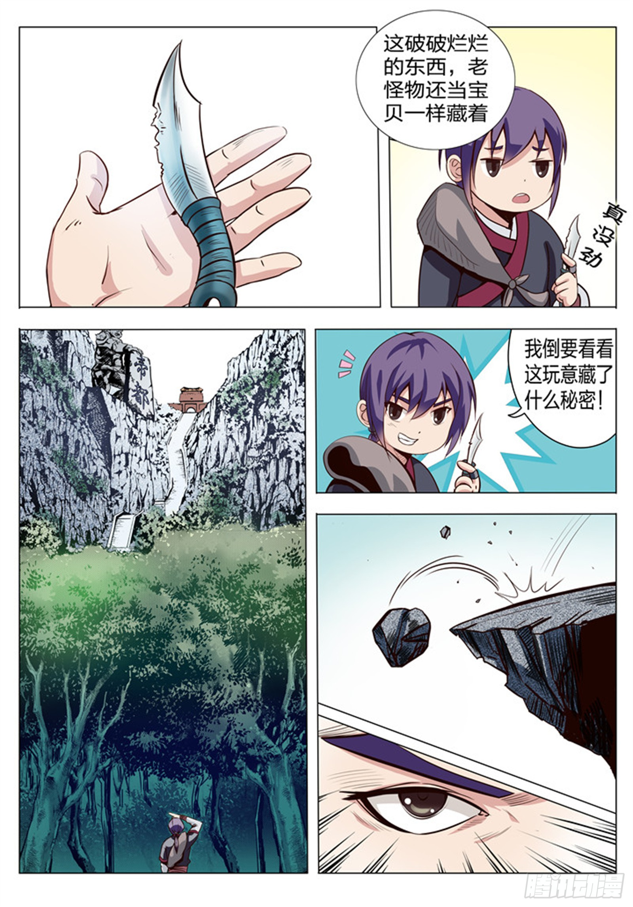
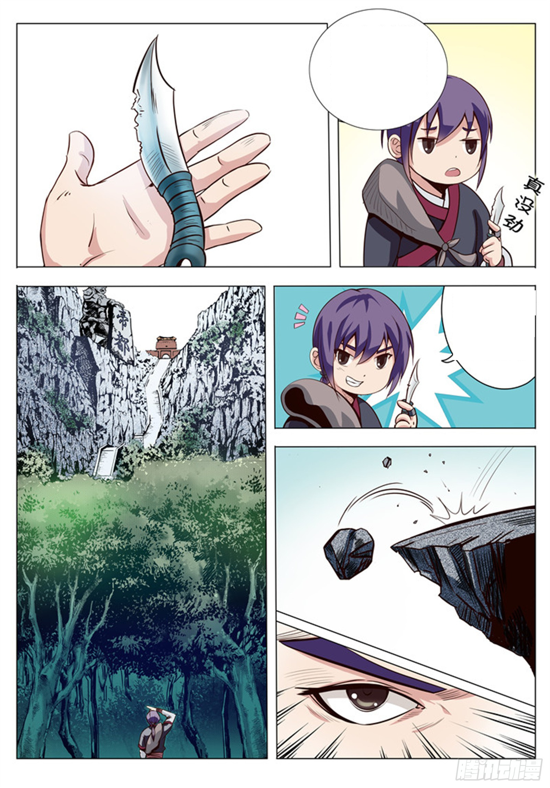

# Idea

This project aims to automatically translate Chinese comics into English by using OCR and background removal techniques.

# Steps Overview

1. Perform OCR to detect Chinese characters.
2. Combine closes bounding boxes to combine Chinese characters into sentences.
3. Delete the bounding boxes from the image and do background fill based on surrounding backgrounds.
4. Translate the Chinese sentences into English via translation API.
5. Place the English sentences back into their corresponding bounding boxes in a sphere-like shape.
6. Output the final image.

# Results

### Original

### Cleaned

### Output

English texts are visible with big enough font. The tilted monologue in the upper right panel is left alone.

### Cotrans Output (An existing online automatic comic translation service)

As you can see, the English texts are not centered correctly in a sphere-like manner. The fonts are also a little too small. They did successfully detect the tilted monologue in the upper right panel.
